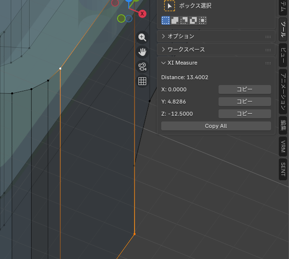

# XI Measure Blender Addon

This Blender addon measures the distance between two selected vertices in Edit Mode.

## Features

- Automatically measures distance when exactly two vertices are selected in Edit Mode.
- Displays the Euclidean distance and differences in X, Y, Z global coordinates in the N-panel (Tool tab).
- Copy buttons for each component (X, Y, Z) and all values to clipboard.
- Useful as a precursor tool for equalizing distances in X, Y, Z axes separately.

## Installation

1. Download or clone this repository.
2. In Blender, go to Edit > Preferences > Add-ons.
3. Click "Install..." and select the folder containing `__init__.py`.
4. Enable the addon "XI Measure".

## Usage

1. Enter Edit Mode on a mesh object.
2. Select exactly two vertices.
3. The distances will automatically appear in the N-panel > Tool tab > XI Measure.
4. Click "Copy" next to each value to copy individually, or "Copy All" for the full set.

## Screenshots

## Notes

- Only works when exactly two vertices are selected.
- Distances are calculated in global coordinates.
- The panel updates automatically on selection changes.
